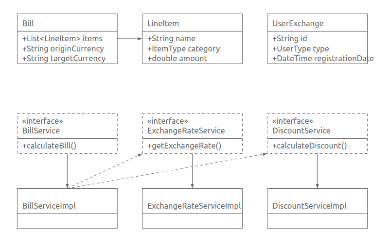

# Currency Exchange Calculator Service

## UML Class Diagram


## Technologies
- Java 21
- Spring Boot 3.2
- Maven
- JUnit 5, Mockito
- SonarQube
- Swagger/OpenAPI
- Docker (optional)

## Getting Started

### SonarQube Setup

#### With Docker:
```bash
docker pull sonarqube:latest
docker run -d -p 9000:9000 sonarqube:latest
```
#### Without Docker:

Download SonarQube Community
Extract and run:

Linux/Mac: bin/linux-x86-64/sonar.sh start

Default credentials: admin/admin 

##  Build
```
mvn clean install
```
## Run
```
mvn spring-boot:run
```
## Run with profile
```
mvn spring-boot:run -Dspring-boot.run.profiles=localhost
```

### API Documentation
Swagger UI: http://localhost:9080/api/swagger-ui/index.html

Example request:

```
POST /api/calculate
{
"items": [{
"name": "Iphone 11",
"category": "ELECTRONICS",
"amount": 250.00
}],
"user": {
"type": "EMPLOYEE",
"registrationDate": "2025-01-17T08:47:01.483Z"
},
"originalCurrency": "USD",
"targetCurrency": "EUR"
} 
```


## Run unit tests
```
mvn test
```
### Generate JaCoCo coverage report
```
mvn test jacoco:report
```

### SonarQube analysis
```
mvn sonar:sonar -Dsonar.login=sqa_e4b38402cea0243c9260605e0f4344f4252f8a5d
ps: you should generate your own token for sonar see below
```

### Run checkstyle
```
mvn checkstyle:check
```
### Run SpotBugs
```
mvn spotbugs:check
```
### View reports:

JaCoCo: target/site/jacoco/index.html

SonarQube: http://localhost:9000/dashboard 
first username: admin 
first password: admin (then you should change them)
After that you can create a token 

## External API
Exchange rates from ExchangeRate-API:

- Endpoint: https://open.er-api.com/v6/latest/{base_currency}
- Cached for 1 hour